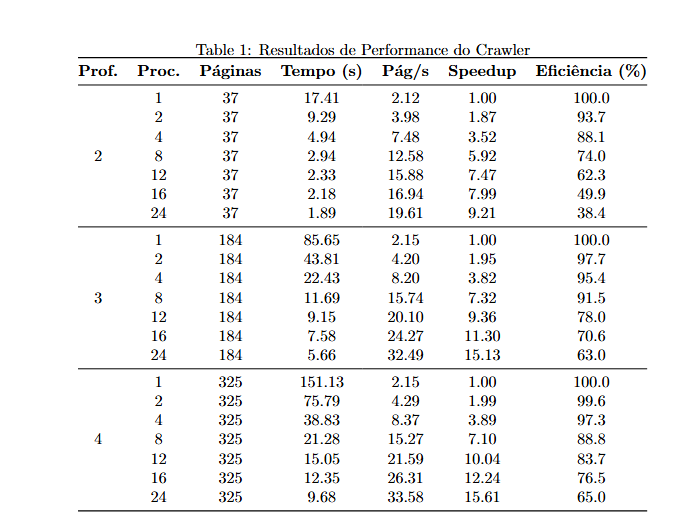
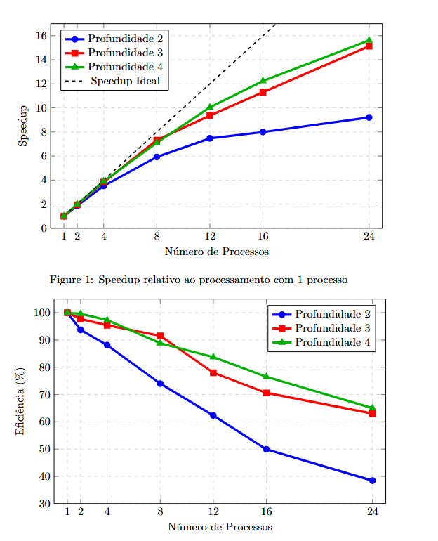

# Crawler

Um sistema de crawler inteligente que combina raspagem de dados web com IA para análise semântica de conteúdo.

## 📋 Introdução

O Crawler é uma solução completa para extração e análise de conteúdo web que integra técnicas de web scraping paralelo com processamento de linguagem natural. O sistema oferece capacidades avançadas de busca semântica através de embeddings e modelos de linguagem, permitindo não apenas a coleta de dados, mas também a compreensão contextual do conteúdo extraído.

## 🎯 Descrição do Problema

Na era digital atual, a necessidade de extrair e analisar grandes volumes de informações da web é crescente. Os desafios incluem:

- **Escalabilidade**: Processar milhares de páginas web de forma eficiente
- **Análise Semântica**: Ir além da simples extração de texto para compreender o contexto
- **Performance**: Otimizar o tempo de processamento sem comprometer a qualidade
- **Flexibilidade**: Suportar diferentes modos de operação conforme a necessidade

Soluções tradicionais de web scraping são limitadas por:
- Processamento sequencial lento
- Falta de capacidades de análise semântica
- Dificuldade em realizar buscas contextuais
- Ausência de armazenamento estruturado para consultas avançadas


### Descrição da Solução

- **🔄 Web Scraping Paralelo**: Extração eficiente usando processamento paralelo com até 24 processos simultâneos
- **🧠 Processamento com IA**: Utilização de embeddings e LLMs para análise contextual
- **📊 Banco de Dados Vetorial**: Armazenamento com ChromaDB para busca semântica
- **🔍 Busca de Palavras**: Contagem e pesquisa por termos específicos
- **💻 Interface Terminal**: Operação completa via linha de comando

### Modos de Execução

1. **Scraping Puro**: Coleta de dados sem análise semântica
2. **Scraping + IA**: Coleta com indexação vetorial e consultas semânticas
3. **Scraping + Busca**: Coleta com análise estatística de palavras
4. **Modo Interativo**: Interface para consultas ao banco vetorial

### Arquitetura

```
URL Base → Scraping Paralelo → Processamento IA → Armazenamento Vetorial → Consultas Semânticas
    ↓           ↓                     ↓                    ↓
Profundidade → Processos → Embeddings → ChromaDB → RAG (Retrieval-Augmented Generation)
```

### Configurações

- **URL Base**: URL inicial para o processo de scraping
- **Profundidade Máxima**: Níveis de links a seguir (1-4)
- **Processos**: Número de processos paralelos (1-24)
- **IA**: Ativação/desativação do processamento semântico


### Tabela de Performance

|


**Recomendações de Configuração:**
- **Workloads Pequenos** (Prof. 2): 4-8 processos
- **Workloads Médios** (Prof. 3): 8-16 processos  
- **Workloads Grandes** (Prof. 4): 16-24 processos
- **Configuração Equilibrada**: 12-16 processos (melhor relação performance/eficiência)

### Dependências

```bash
pip install -r requirements.txt
```

### Principais Dependências

- `chromadb` - Banco de dados vetorial
- `urllib3` - Requisições HTTP
- `concurrent.futures` - Execução paralela
- `langchain` + `ollama` - Integração com LLMs
- `beautifulsoup4` - Parsing HTML

### Execução

```bash
python crawler.py
```

## 🎯 Conclusão

O Crawler demonstra excelente escalabilidade e eficiência no processamento paralelo de conteúdo web. Os resultados dos benchmarks evidenciam:

### Principais Conquistas

1. **Escalabilidade Excepcional**: Speedup de até 15.6x com processamento paralelo
2. **Performance Otimizada**: Throughput máximo de 33.58 páginas/segundo
3. **Eficiência Mantida**: >90% de eficiência até 8 processos paralelos
4. **Flexibilidade Operacional**: Múltiplos modos de execução conforme necessidade

### Impacto e Benefícios

- **Redução de Tempo**: Processamento 15x mais rápido comparado ao sequencial
- **Análise Inteligente**: Capacidades de busca semântica com IA
- **Versatilidade**: Suporte tanto para coleta simples quanto análise complexa
- **Otimização de Recursos**: Configurações adaptáveis ao hardware disponível

### Limitações Identificadas

- Diminuição da eficiência com >16 processos devido ao overhead
- Repetição de palavras por sobreposição de chunks
- Alta demanda de processamento para funcionalidades de IA

O sistema representa uma solução robusta e escalável para extração e análise de conteúdo web, adequada tanto para aplicações acadêmicas quanto comerciais que exigem recuperação semântica de informações.

---

## 👥 Autores

- **Isaque Evangelista**
- **Ezio Pacheco**

*Maio de 2025*